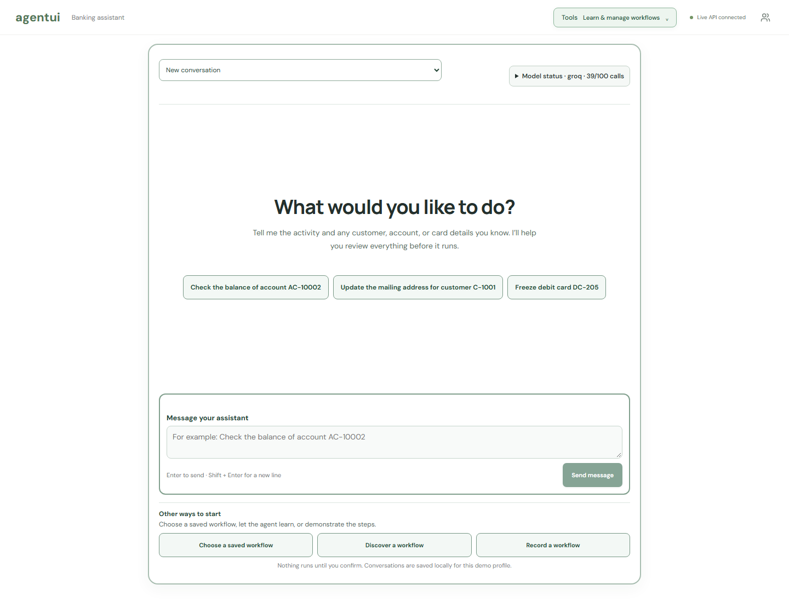
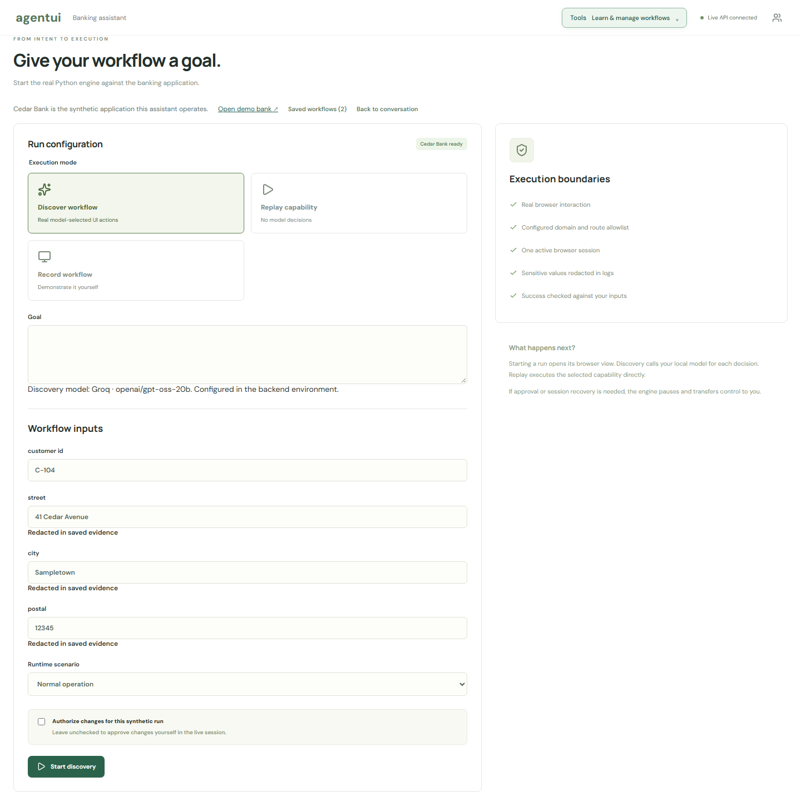
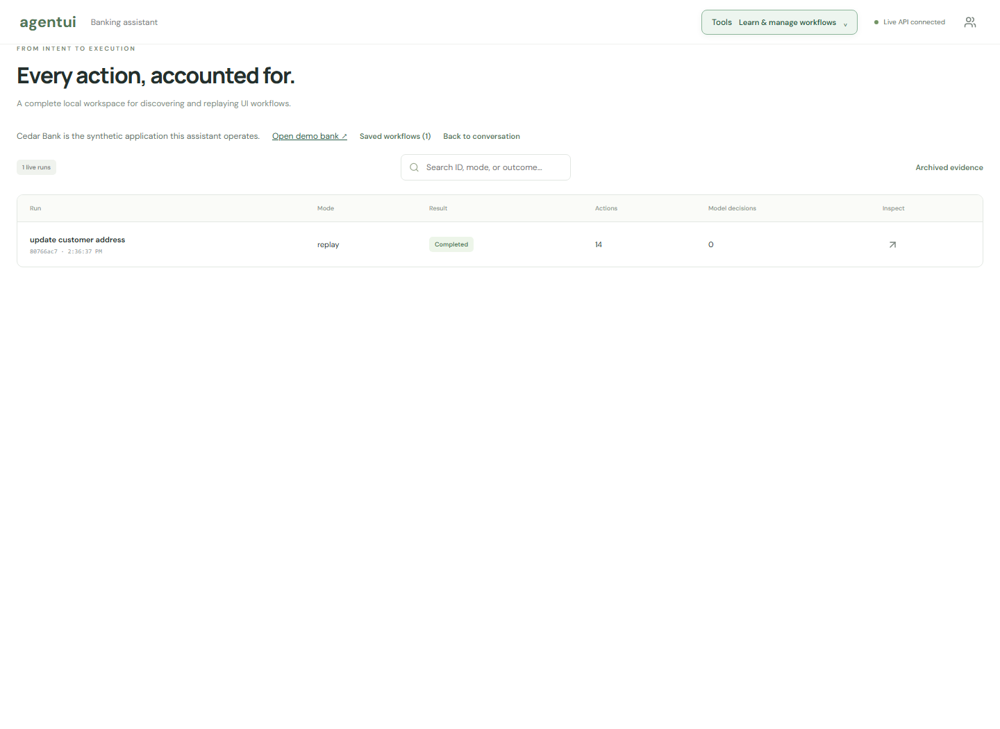
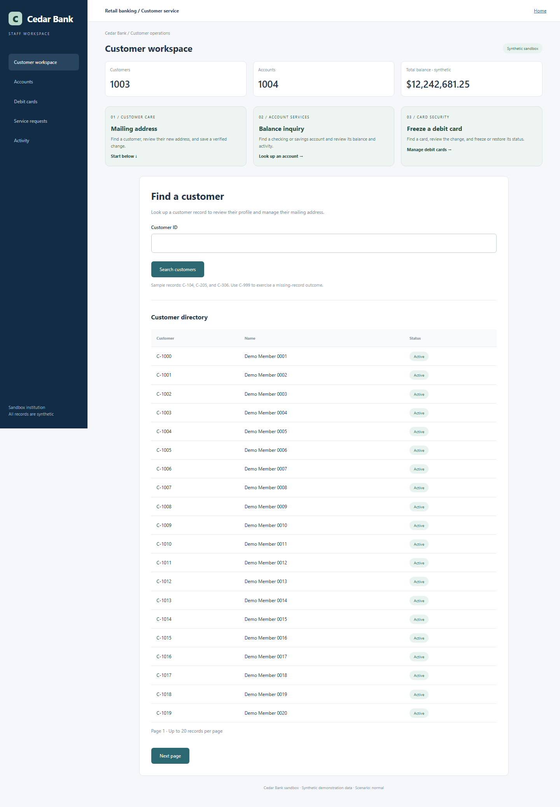
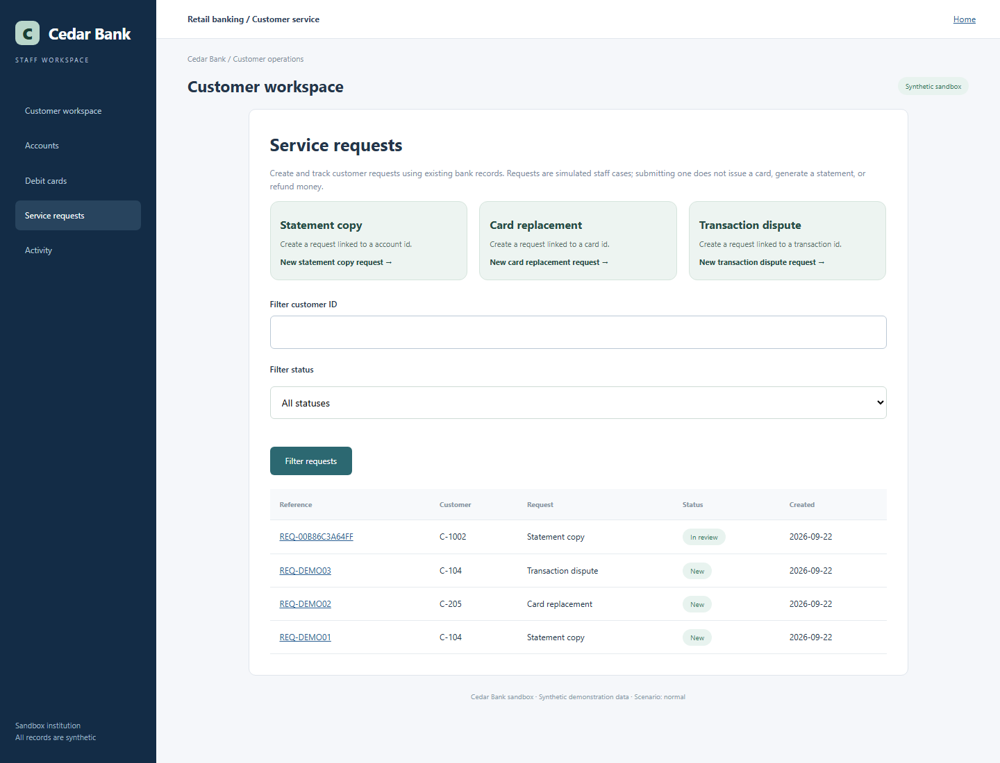
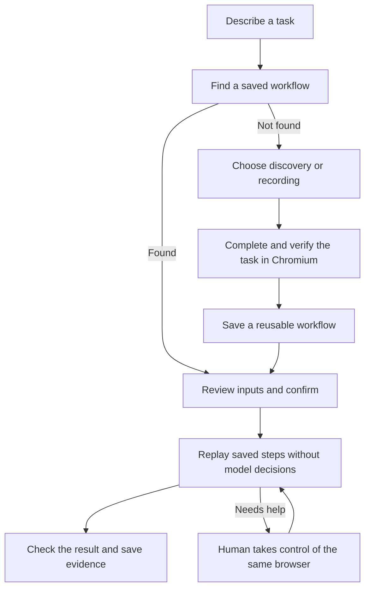

# Agent UI Execution Engine

I built this project to turn repeated browser tasks into reusable workflows.

A staff member might open the same screens and fill the same form for hundreds of customers. I wanted an AI to learn that process once, then let ordinary code repeat it with different inputs. That avoids asking a model what to click on every run.

My engine gives a model a goal and lets it operate a real Chromium browser. After the result is verified, it saves the steps, required inputs, expected outputs, and success checks. A later run follows those steps without model decisions. I also added manual workflow recording, live browser viewing, and human takeover for actions that need approval.

I built **Cedar Bank**, a separate application with synthetic customers, accounts, cards, and service requests, to test the engine. No real bank accounts or money are involved.

The sections below explain what I built and how to run the same examples yourself.



I captured these screenshots from the running app. Your saved workflows and usage counts will differ. The actual discovery and replay logs are in [evidence](evidence/README.md).

## Find what you need

- [Try the main features](#try-the-main-features)
- [Install and start the app](#install-and-start-the-app)
- [Set up the AI provider](#set-up-the-ai-provider)
- [Try your first task](#try-your-first-task)
- [Let the AI learn a workflow](#let-the-ai-learn-a-workflow)
- [Record a workflow yourself](#record-a-workflow-yourself)
- [Take control or stop a run](#take-control-or-stop-a-run)
- [What each screen does](#what-each-screen-does)
- [What the bank can do](#what-the-bank-can-do)
- [Use the HTTP API](#use-the-http-api)
- [Use the command line](#use-the-command-line)
- [Where things are saved](#where-things-are-saved)
- [How it works](#how-it-works)
- [Test and troubleshoot](#test-and-troubleshoot)
- [What I built and tested](#what-i-built-and-tested)

## Try the main features

Start the app using the installation steps below. These examples use the same address workflow so you can compare learning, replay, and human approval without changing tasks.

### Learn a new workflow

1. Send this in chat: `Update the mailing address for customer C-104 to 28 Maple Street, Fremont, postal code 94538.`
2. If no saved workflow matches, the assistant checks whether it can learn the task and extracts the values. It asks in chat for anything missing; you do not need to repeat the details in a setup form.
3. Review the short summary. Check **Authorize changes for this synthetic run** if you want it to perform the save without a handoff.
4. Click **Confirm and start discovery**. Watch the model operate the bank through the managed browser.
5. After success, open **Tools → Saved workflows** to inspect the learned steps and input/output definitions.

If a matching workflow is already saved, chat offers replay instead. The separate **Discover a workflow** setup remains available when you explicitly want to learn another version or choose a runtime scenario.

This uses the configured model. Discovery can take several minutes and can fail; inspect the result before treating a workflow as learned. The built-in discovery contract is for address changes.

### Repeat it for another customer

1. Return to chat and send: `Update the mailing address for customer C-205 to 52 Example Road, Testville, postal code 23456.`
2. Select **Use this workflow** on the learned address workflow.
3. Review all values, authorize the synthetic change, and click **Run workflow**.
4. Open **Tools → Past runs**. The replay should show zero model decisions.

Chat matching and input extraction can call the model. The subsequent replay does not. To avoid model calls entirely, select the workflow through **Tools → Saved workflows** and enter the values manually.

### Approve a change yourself

1. Open **Tools → Learn a new workflow**, select **Replay capability**, and choose the learned address workflow.
2. Use `C-306`, `63 Review Lane`, `Exampleton`, and `34567`.
3. Leave **Authorize changes for this synthetic run** unchecked. Click **Start replay**.
4. When the engine pauses at the review screen and gives you control, click **Save address inside the managed browser**.
5. Wait for **Address updated**, then click **Resume automation**. The engine should verify the result and finish.

Use the same managed session, not the separate Cedar Bank tab. The handoff expires after five minutes. **Cancel run** stops an attempt; it does not undo changes already saved.

### Try an expected outcome and a runtime error

- **Missing customer:** replay with `C-999`, `74 Example Street`, `Sampletown`, and `45678`, using Normal operation. Expect a `business_outcome` for Customer not found, without an address save.
- **Recoverable search failure:** replay with `C-205`, `85 Example Avenue`, `Testville`, and `56789`. Choose the transient-search-failure scenario and authorize the save. Expect one known recovery action followed by normal execution.
- **Permission denied:** use the same valid inputs with the permission-denied scenario. Expect a failure with evidence, not an attempt to bypass access controls.

These faults are deliberately injected by the demo bank. They show how I separated expected results, known recovery paths, and hard failures.

### Teach a balance inquiry by hand

1. Choose **Record a workflow**, name it `Look up an account balance`, and start recording.
2. In the managed browser, open **Accounts**, fill Account ID with `AC-10002`, apply the field value, click **Search accounts**, then **Open account**.
3. At **Account balance verified**, choose **Stop recording & review**.
4. Check the inferred input, success heading, and returned fields. Choose **Finish and review recording**, then **Publish reviewed workflow**.
5. Replay it with `AC-10003`.

This is a human-authored workflow, not model discovery. It is an alternative way to teach the engine; it is not required before running discovery.

## Install and start the app

Choose **one** setup below. Both run on your computer. Docker includes its own database and runtime. The non-Docker setup uses Python, Node.js, and a local SQLite database.

The commands below are for **Windows PowerShell**. Run them from the repository folder unless a step says otherwise.

### 1. Download the project

Install Git first, then open PowerShell in the folder where you keep projects:

```powershell
git clone https://github.com/nh0397/agent-ui-execution-engine.git
cd agent-ui-execution-engine
```

If you already have the repository, open that folder instead. Do not clone another copy just to restart it.

Create your settings file once:

```powershell
if (-not (Test-Path .env)) { Copy-Item .env.example .env }
notepad .env
```

Use the provider settings in the next section. Keep `.env` private. It is excluded from Git.

### 2A. Start with Docker

Install Docker Desktop, enable Linux containers, and wait for Docker Desktop to finish starting. You do not need to install Python or Node.js on the host for this route.

```powershell
powershell -NoProfile -ExecutionPolicy Bypass -File .\start.ps1 -OpenBrowser
```

The first run downloads and builds the containers. The script creates a database password if one is missing, starts four services, and checks that they respond.

| Open this | Address |
| --- | --- |
| Chat and workflow workspace | http://127.0.0.1:5173 |
| Cedar Bank | http://127.0.0.1:8000 |
| Execution API reference | http://127.0.0.1:5173/api/docs |

The four services are `dashboard` (the web screen), `worker` (the Python engine and Chromium), `app` (Cedar Bank), and `db` (PostgreSQL). The database and worker are not directly exposed on host ports.

Check or stop them:

```powershell
docker compose ps
docker compose logs --tail 60 worker app
docker compose down
```

`docker compose down` keeps saved data. Do not add `-v` unless you intend to delete the database and workflow volumes.

To start again, run `start.ps1` again. After editing provider settings in `.env`, recreate the worker:

```powershell
docker compose up -d --force-recreate worker
```

### 2B. Start without Docker

Install **Python 3.11 or later** and a Node.js version supported by the bundled Vite version; **Node.js 22.12 or later in the 22.x line** is a suitable starting point. Make sure `python`, `node`, and `npm.cmd` work in a new PowerShell window.

```powershell
python --version
node --version
npm.cmd --version
powershell -NoProfile -ExecutionPolicy Bypass -File .\start-local.ps1 -OpenBrowser
```

The script creates `.venv`, installs Python packages, downloads Playwright Chromium, installs frontend packages, builds the screen, and starts the two Python services in the background. Allow time for downloads on the first run.

| Open this | Address |
| --- | --- |
| Chat and execution API | http://127.0.0.1:5174 |
| Cedar Bank | http://127.0.0.1:8000 |
| Execution API reference | http://127.0.0.1:5174/api/docs |

Logs are in `work/local/bank.out.log`, `bank.err.log`, `api.out.log`, and `api.err.log`. The startup script reuses healthy services. Running it again does **not** restart an already-running backend after a code or settings change.

To find the processes using these ports:

```powershell
Get-NetTCPConnection -State Listen -LocalPort 5174,8000 |
  Select-Object LocalAddress,LocalPort,OwningProcess
```

Inspect the reported process before stopping it:

```powershell
Get-CimInstance Win32_Process -Filter "ProcessId = 12345" |
  Select-Object ProcessId,CommandLine
# Replace 12345 with the confirmed project process ID.
Stop-Process -Id 12345
```

Then run `start-local.ps1` again. Stop both project processes when you are finished. Stopping a worker ends its live browser session; finish or cancel any active run first.

### Which ports should I use?

Use the addresses printed by your startup command. The development screenshots were taken on a custom setup using **5176 for the workspace/API** and **8003 for the bank**. Those are not the startup scripts' defaults. Different workspaces can have different data, even on the same machine.

Do not run Docker and the default non-Docker bank at the same time: both want port 8000.

## Set up the AI provider

There are two different APIs in this project:

- **The model provider API** helps the chat understand requests and lets discovery choose UI actions.
- **This app's HTTP API** starts runs, returns results, and controls the browser. It is described below.

### Option A: Groq

Obtain a Groq API key from your own account. Put it in the root `.env` file:

```dotenv
LLM_PROVIDER=groq
GROQ_API_KEY=replace_with_your_key
GROQ_MODEL=openai/gpt-oss-20b
LLM_DAILY_REQUEST_LIMIT=100
LLM_REQUESTS_PER_MINUTE=10
```

The model name above is the project's tested configuration. Your provider account must allow that model. Restart the local backend, or recreate the Docker worker, after changing these settings.

The key stays on the Python backend. Do not put it in frontend code, a chat message, screenshots, or a commit. Do not prefix it with `VITE_`.

### Option B: Ollama

Install and start Ollama, then download one of the models supported by the UI:

```powershell
ollama pull mistral:latest
```

Use these settings:

```dotenv
LLM_PROVIDER=ollama
OLLAMA_URL=http://127.0.0.1:11434
LLM_DAILY_REQUEST_LIMIT=100
LLM_REQUESTS_PER_MINUTE=10
```

Choose `mistral:latest` in workflow setup. `llama3.1:latest` is also supported if you have installed it. Local inference needs enough memory and can be slow.

The Docker worker uses `http://host.docker.internal:11434` to reach Ollama on the host. Ollama must accept that connection. A host-only Ollama listener may work for local Python but not for Docker.

### When does the app call the model?

| Action | Model call? |
| --- | --- |
| Match a chat request to a non-empty workflow catalog | Yes |
| Extract input values from a chat message | Yes |
| Discover which UI action to take next | Yes, repeatedly |
| Choose a workflow manually and fill its form | No |
| Replay a saved workflow | No |
| Record steps yourself | No |
| Read model status, history, or evidence | No |

Open **Model status** in chat to see request counts, reported token usage, and the last provider limits the app received. The defaults allow 100 attempts per UTC day and 10 per rolling minute for this workspace. They are application guards, not a promise that your provider quota cannot be exhausted. Other programs may use the same account, and the provider may not report every limit.

Discovery can wait before an unsent request when pacing or reported token capacity requires it. A rejected request is not silently retried. The app reports missing keys, provider errors, timeouts, and rate limits. It does not automatically switch providers.

For Groq, a healthy configuration indicator means a key is present; it does not prove that the key or its remaining quota is valid. A real model request is needed to verify that.

## Try your first task

Start with the bundled address workflow. A fresh workspace normally lists it as `example`. A workspace that was deliberately cleared may hide it.

1. Open the workspace.
2. Choose **Choose a saved workflow**, or **Tools → Saved workflows**.
3. Choose the address-update workflow and open replay with new inputs.
4. Use these synthetic details:

   | Field | Value |
   | --- | --- |
   | customer_id | C-205 |
   | street | 52 Example Road |
   | city | Sampletown |
   | postal | 12345 |

5. Keep **Normal operation** as the scenario.
6. Review the details. To let the engine save the synthetic change, check the write-authorization box. If you leave it unchecked, you must perform the save during human takeover.
7. Start replay. Watch it search, open the customer, fill the address, review, and save.
8. Check the final result and **Tools → Past runs**.

This path works without a model. The engine checks the confirmation and saved fields rather than assuming that a click means success.

Once a model is configured, try the same task through chat:

> Update the mailing address for customer C-205 to 52 Example Road, Sampletown, postal code 12345.

The assistant suggests a saved workflow. Select it, review the extracted values, add anything missing, and confirm. A chat message alone does not authorize a write.

If no workflow matches, the assistant can prepare address-change discovery directly in chat. It extracts the values, asks for missing details, and waits for your confirmation. Unsupported tasks still need a suitable contract or manual recording. The example chat prompts are suggestions, not a guarantee that every corresponding workflow is already saved.

## Let the AI learn a workflow

**Discovery** means the model looks at the current page, chooses a permitted action, and repeats until the result is verified. You can start from an English address-change request in chat; the separate form below is an alternative for explicit configuration.



1. Click **Discover a workflow**, or open **Tools → Learn a new workflow** and select **Discover workflow**.
2. Enter this goal:

   > Update the customer identified by customer_id with the supplied street, city and postal inputs. Verify the saved customer ID and all saved address fields. Return every declared output.

3. Enter `C-104`, `41 Example Avenue`, `Sampletown`, and `12345` in the four input fields.
4. Keep the normal scenario. Review the provider shown below the goal.
5. Choose whether to authorize the synthetic save or perform it yourself at handoff.
6. Click **Start discovery**. The real browser opens alongside the chat. Discovery may take several minutes.
7. On verified success, the app saves a new capability. Choose **Replay this new capability** and use a different customer and address.

A **capability** is the saved workflow file: what inputs it needs, what steps it takes, and what result it must check.

The current discovery form uses an address-change contract. Changing the goal text alone does not turn it into a general-purpose bank agent. To discover a different task through the CLI, supply a matching input/output specification and policy. The model learns the action sequence; it does not create the entire task contract.

## Record a workflow yourself

**Recording** means you operate the managed browser and the engine captures supported steps. You do not need to name parameters before you start.

For a first recording, use a balance inquiry because it does not change bank data:

1. Click **Record a workflow**. Name it `Look up an account balance` and start recording.
2. In the managed bank view, click **Accounts**.
3. Click **Account ID** and enter `AC-10002` in the field editor. Press Enter or leave the field to apply it.
4. Click **Search accounts**, then **Open account**.
5. Wait for **Account balance verified**.
6. Click **Stop recording & review**. Check the inferred account input and the result fields. Keep the success heading `Account balance verified`.
7. Rename an input if its inferred name is unclear. Check which readonly fields should be returned, then choose **Finish and review recording**.
8. Review the saved steps and masked screenshots. Click **Publish reviewed workflow** to make it available for replay.
9. Replay it with `AC-10003`. Or ask in chat: `Check the balance of account AC-10003`, then select your published workflow and review the input.

Use **Continue recording** if you stopped too soon. **Cancel run** ends the attempt without publishing it. A stopped recording is still a live session until you finish or cancel it.

Record inside the managed browser, not the separate **Open Cedar Bank** tab. The recorder does not watch other tabs or your desktop.

Clicks and applied text fields get masked before/after screenshots. A text field update is one event, not a video of every keystroke. Scroll actions are logged without screenshots. Passwords, ambiguous targets, and unsupported controls are rejected. The standard recorder is designed for the demo's supported text fields and controls, not every possible website widget.

From **Past runs**, download the step document and images, or create a WebM playback. The playback is assembled from saved masked frames; it is not continuous footage or a cursor recording.

## Take control or stop a run

During automation, the engine owns the managed browser. Clicks and typing from the operator are blocked until ownership changes.

- **Request control:** asks the engine to pause at the next safe boundary.
- **Your review is needed:** the engine has paused for a protected write or another condition that needs help.
- **Resume automation:** returns control after you complete the requested action and reach the displayed checkpoint.
- **Cancel run:** asks the current operation to stop. It does not undo completed changes.

For an address-save handoff, leave write authorization unchecked. When the review screen appears, inspect it, click **Save address** inside the live browser, wait for **Address updated**, and resume. This is the same browser session, not a new login or tab.

You can use the wheel or trackpad over the managed browser while you own it. Scroll buttons and supported keyboard controls are also available. A pending model request or browser operation may need to return before a pause or cancel takes effect.

The control lock only affects this managed session. It does not lock your computer. A worker restart loses the live browser and marks unfinished jobs as failed; it cannot resume that browser later.

## What each screen does

| Screen or control | What it is for |
| --- | --- |
| Chat | Describe a task, choose a suggested workflow, supply details, and review before running. Enter sends; Shift+Enter adds a line. |
| Conversation list | Reopen saved conversations for the selected demo profile. |
| New request | Start a separate conversation. It does not stop an active run. |
| Model status | See provider configuration, usage, and last observed limits. |
| Choose a saved workflow | Pick a workflow directly without asking the model to find one. |
| Discover a workflow | Open the goal and input form for model-driven learning. |
| Record a workflow | Teach supported steps through the managed browser. |
| Tools → Saved workflows | Inspect inputs, outputs, ordered actions, source, and version; start replay. |
| Tools → Past runs | Inspect results, events, recordings, and available evidence downloads. |
| Tools → Open Cedar Bank | Explore the target app manually in a separate tab. This tab is not being recorded. |
| Live browser | Watch the actual Chromium session. Interact only when control belongs to you. |
| Profile selector | Choose Mira or Sam as an operator, or Taylor as a viewer. These are demo identities, not secure user accounts. |

Conversations are saved locally. Refreshing can restore messages and entered values, but never restores write approval or starts a task automatically. If saving fails, the screen reports it. A revision conflict means another window changed the same conversation; reload before continuing.



This history screenshot comes from running the PowerShell API example in this guide against a separate test database. It used the bundled reference capability, not a new model discovery.

## What the bank can do



The seeded database has 1,003 customers, 1,004 accounts, 1,003 debit cards, and more than 4,000 transactions. Directories are paginated, so the first page is not the full database. Seeding preserves existing records and edits.

| Feature | What you can do |
| --- | --- |
| Customer servicing | Search a customer, view their details, edit a mailing address, review it, and save. |
| Accounts | Search an account and view its balance and recent activity. |
| Debit cards | Search a card, review its state, and freeze or unfreeze it. |
| Activity | Browse synthetic account transactions. |
| Statement-copy requests | Open a staff case linked to an account. |
| Card-replacement requests | Open a staff case linked to a debit card. |
| Transaction disputes | Open a staff case linked to a transaction. |
| Request tracking | Move a case from New to In review to Resolved, with notes and a status history. |



Requests check that the selected record belongs to the customer. Submissions avoid duplicates, and stale status updates are rejected. These are staff cases: they do not produce real statements, issue cards, or refund money.

Useful test records:

| Record | Example |
| --- | --- |
| Customers | C-104, C-205, C-306, C-1000 through C-1999 |
| Accounts for balance recordings | AC-10002, AC-10003 |
| Card | DC-205 |
| Deliberately missing customer | C-999 |

Bank features and saved automation workflows are separate. A feature can exist in the bank before anyone teaches the engine how to use it.

## Use the HTTP API

The React screen calls this same API. You can call it from a script instead. This API controls browser workflows; it is not a shortcut that directly updates the bank database.

The examples below use **PowerShell**, the non-Docker API at port **5174**, and the bundled address capability. For Docker, change `$base` to `http://127.0.0.1:5173`. For the custom development workspace, use its actual port.

### 1. Open a session

```powershell
$base = 'http://127.0.0.1:5174'
$session = Invoke-RestMethod -Method Post -Uri "$base/api/session" `
  -Headers @{ Origin = $base } -ContentType 'application/json' `
  -Body '{"profile_id":"mira"}' -SessionVariable workspace

$headers = @{ Origin = $base; 'X-CSRF-Token' = $session.csrf }
```

Keep `$workspace`: it contains the session cookie. Keep `$headers`: they contain the Origin and the session's CSRF token, which protects write requests. The model API key is **not** an authentication key for this API.

Sessions last eight hours and disappear when the backend restarts. Use `mira` or `sam` for an operator, or `taylor` for a viewer. Viewer sessions cannot start, control, or publish runs. These profiles are for a local demo, not production authentication.

### 2. Check health and list workflows

```powershell
Invoke-RestMethod "$base/api/health"
$catalog = Invoke-RestMethod "$base/api/capabilities" -WebSession $workspace
$catalog | Select-Object id, @{Name='name';Expression={$_.capability.name}}
Invoke-RestMethod "$base/api/model/status" -WebSession $workspace
```

Read the chosen capability's `inputs` before starting it. The fresh-install address workflow has ID `example`. If it has been hidden, use the ID of a published address workflow from your catalog. Do not assume that a bank customer ID is a workflow ID.

### 3. Start an address replay

This example changes the synthetic customer C-205. `approve_writes = $true` explicitly authorizes its protected save for this run.

```powershell
$body = @{
  mode = 'replay'
  capability_id = 'example'
  inputs = @{
    customer_id = 'C-205'
    street = '52 Example Road'
    city = 'Sampletown'
    postal = '12345'
  }
  scenario = 'normal'
  approve_writes = $true
} | ConvertTo-Json -Depth 6

$job = Invoke-RestMethod -Method Post -Uri "$base/api/runs" `
  -WebSession $workspace -Headers $headers `
  -ContentType 'application/json' -Body $body
$job.id
```

The response is HTTP 202 with a job ID. That means accepted, not completed. Only one run can be active at a time.

### 4. Wait for the result

```powershell
do {
  Start-Sleep -Seconds 1
  $run = Invoke-RestMethod "$base/api/runs/$($job.id)" -WebSession $workspace
  Write-Host "$($run.status): $($run.code)"
} while ($run.status -eq 'running')

$run | ConvertTo-Json -Depth 12
```

The final status is `success`, `business_outcome`, or `failure`. A business outcome means the task reached an expected result such as “Customer not found”; it is not an engine crash. Sensitive outputs in the HTTP run/evidence response are redacted.

If you set `approve_writes` to `false`, do not just wait for completion: watch `live.owner` and `live.intervention`, perform the requested action in the same managed browser, and resume. Otherwise the intervention will time out.

### 5. Download evidence or request cancellation

```powershell
Invoke-RestMethod "$base/api/runs/$($job.id)/evidence" -WebSession $workspace |
  ConvertTo-Json -Depth 30 | Set-Content -Encoding utf8 run-evidence.json
```

For an **active** job, cancellation is:

```powershell
Invoke-RestMethod -Method Post -Uri "$base/api/runs/$($job.id)/control" `
  -WebSession $workspace -Headers $headers -ContentType 'application/json' `
  -Body '{"kind":"abort"}'
```

### Other run types

Use the same session, headers, and `POST /api/runs` endpoint. For discovery, send:

```json
{
  "mode": "discovery",
  "goal": "Update the customer identified by customer_id with the supplied street, city and postal inputs. Verify all saved fields and return every declared output.",
  "inputs": {
    "customer_id": "C-104",
    "street": "41 Example Avenue",
    "city": "Sampletown",
    "postal": "12345"
  },
  "scenario": "normal",
  "approve_writes": true
}
```

This makes real model requests. The provider comes from `.env`. With Groq, `GROQ_MODEL` selects the model. The optional request field `model` selects an Ollama model (`mistral:latest` or `llama3.1:latest`); it does not override `GROQ_MODEL`.

For recording, send:

```json
{
  "mode": "recording",
  "name": "Look up an account balance",
  "goal": "Find an account and verify its balance"
}
```

Recording starts a browser for you to operate. It does not automatically perform that goal. The workspace is the easiest way to send recording commands and review the draft.

### All API routes

Open `/api/docs` for request fields, types, and schemas, or `/api/openapi.json` for the machine-readable description. Browser Swagger requests still need a session and valid write headers; use the session example above for scripted calls.

| Method and path | Purpose |
| --- | --- |
| `GET /api/health` | Check API readiness, bank reachability, and model configuration. No session required. |
| `POST /api/session` | Choose a demo profile and receive a session cookie and CSRF token. Requires an allowed Origin. |
| `GET /api/model/status` | Read usage and last observed limits without a model call. |
| `GET /api/workflow-spec` | Read the built-in discovery input/output contract. |
| `GET /api/capabilities` | List published workflows and their full contracts. |
| `POST /api/agent/match` | Send `message`; suggest a saved capability. Does not execute it. |
| `POST /api/agent/inputs` | Send `message` and `capability_id`; extract supplied values. Use `address-discovery` for follow-up discovery inputs. Does not execute. |
| `POST /api/agent/discovery` | Send `message`; check whether the address task is supported and return its specification and extracted values. Does not start a run. |
| `POST /api/runs` | Start discovery, replay, or recording. |
| `GET /api/runs` | List jobs, newest first. |
| `GET /api/runs/{id}` | Read status, result, events, and live control state. |
| `GET /api/runs/{id}/frame` | Read the latest in-memory JPEG. Returns 204 if no frame exists. |
| `POST /api/runs/{id}/control` | Send supported operator commands. |
| `POST /api/runs/{id}/publish` | Publish a successfully verified recording draft. |
| `GET /api/runs/{id}/captures/{filename}` | Read a recorded masked step image. |
| `GET /api/runs/{id}/document` | Download the recording document and images as a ZIP. |
| `POST /api/runs/{id}/video` | Build step playback after recording finishes. |
| `GET /api/runs/{id}/video` | Download the prepared WebM. |
| `GET /api/runs/{id}/evidence` | Read the sanitized job evidence as JSON. |
| `GET /api/conversations` | List conversations for the current profile. |
| `GET /api/conversations/{id}` | Load a saved conversation. |
| `PUT /api/conversations/{id}` | Save a conversation snapshot with revision checking. |

Except health and session creation, these routes require a session. Write requests also require an allowed Origin and `X-CSRF-Token`.

Control command `kind` can be `click`, `type`, `key`, `scroll`, `request_control`, `resume`, `abort`, `stop_recording`, `continue_recording`, or `finish`. Click coordinates refer to the browser frame, not the surrounding page. Typing uses `text`; keys are limited to Tab, Enter, Escape, and Backspace; scroll uses `delta` from -1000 to 1000. Recording finish also accepts `success_name`, `output_bindings`, and `input_names`. Use the API schema and workspace review form for those bindings. Ordinary input commands are rejected while automation owns the browser.

Conversation IDs are UUIDs. A new snapshot starts with `revision: 0`; each successful save returns the next revision. Snapshots contain `messages` (roles `you` or `agent`), `selected_id`, `values`, `initial_request`, and `run_id`. Send the latest revision on subsequent saves. Saving a conversation does not run anything.

Common responses: **401** means open a session; **403** means check the profile, Origin, or CSRF token; **409** means an active run or state/revision conflict; **422** means invalid input; **429** means a rate or queue limit. Model errors also include readable messages. Inspect the response rather than repeatedly resubmitting a write.

## Use the command line

The CLI is useful when you want explicit files and repeatable commands. Even if Docker runs the bank, install the local Python environment to use this CLI:

```powershell
python -m venv .venv
.\.venv\Scripts\python.exe -m pip install -e ".[test]"
$env:PLAYWRIGHT_BROWSERS_PATH = "$PWD/.browsers"
.\.venv\Scripts\python.exe -m playwright install chromium
```

Keep Cedar Bank running on port 8000. Configure the model in `.env`. Discover an address workflow:

```powershell
.\.venv\Scripts\python.exe -m engine.cli discover `
  --model mistral:latest `
  --goal "Update the customer identified by customer_id with the supplied street, city and postal inputs. Verify the saved customer ID and all saved address fields. Return every declared output." `
  --spec config/address-workflow.json `
  --profile config/customer-service.json `
  --entry http://127.0.0.1:8000 `
  --inputs config/inputs-a.json `
  --capability work/generated/update-address.v1.json `
  --approve-writes
```

`--model` is required by the CLI and selects the Ollama model. When `LLM_PROVIDER=groq`, the provider instead uses `GROQ_MODEL` from the environment. The command above does not switch you back to Ollama.

After discovery succeeds, replay with different inputs:

```powershell
.\.venv\Scripts\python.exe -m engine.cli replay `
  --profile config/customer-service.json `
  --entry http://127.0.0.1:8000 `
  --capability work/generated/update-address.v1.json `
  --inputs config/inputs-b.json `
  --approve-writes
```

To skip discovery, replace the capability path with `capabilities/update-address.v1.json`. Replay does not require a model. Existing capability files are not overwritten; choose a new filename for a new discovery run.

`--approve-writes` authorizes configured protected actions for that invocation. For manual approval, omit it and add `--headed`. At handoff, save in the open browser and type `resume` in the terminal after the confirmation appears. Type `abort` to stop.

If a headed browser is unavailable, use `--operator-port 8766` and open `http://127.0.0.1:8766` during handoff. That page shows the same live session and accepts operator commands. It exists only while intervention is active, which expires after five minutes.

CLI results go to `runs/<run-id>/` by default; `--runs` changes that folder. The terminal prints status, code, run ID, and step, with sensitive results omitted. A failure exits with code 1. CLI runs are separate from dashboard job history and do not automatically appear in its catalog.

For Python callers, `engine.runtime.replay` accepts a `Capability`, input dictionary, `Profile`, entry URL, and run directory. It returns a typed `Result`. Unlike the persisted evidence, the in-process result can contain sensitive output values; do not log it indiscriminately. The CLI source is a small example of this interface.

## Where things are saved

Workflows are **JSON files**, not rows in the banking database.

| Item | Default local location |
| --- | --- |
| Private provider configuration | `.env` |
| Bank customers, accounts, cards, transactions, and cases | `work/customers.sqlite3` |
| Published workflows | `work/dashboard/capabilities/` |
| Unpublished recordings | `work/dashboard/drafts/` |
| Job summaries | `work/dashboard/job-*.json` |
| Run events, results, snapshots, recording documents and images | `work/dashboard/runs/<job-id>/<run-id>/` |
| Saved conversations and entered values | `work/dashboard/conversations.sqlite3` |
| Model request/token accounting | `work/dashboard/model-usage.sqlite3` |
| Standalone CLI output | `runs/<run-id>/` |
| Bundled reference capability | `capabilities/update-address.v1.json` |
| Reviewed, checked-in evidence | `evidence/` |

`DASHBOARD_STORAGE` changes the workspace root. For example, the custom development workspace uses `work/agent-workspace`. Docker uses the `execution-data` volume for workspace data and `demo-data` for PostgreSQL bank data.

Chat history can contain the values you type. It is private local storage, separate from redacted run evidence. Use synthetic data. Live browser frames remain in memory; they are not the same as the masked images saved during recording.

The `.gitignore` excludes local databases, `.env`, browser profiles, generated runs, and working folders. Review any evidence before deliberately adding it to Git.

## How it works



The model receives structured text observations of the page, such as labels, roles, and headings. It proposes a typed action. Python validates the action and policy before Playwright performs it. The model is not given unrestricted Python or JavaScript execution.

Saved steps point to labels, roles, or text rather than recorded screen coordinates. Input values are supplied at run time. Replay checks outputs and the final success state. It makes no model decisions, though a website or runtime failure can still prevent completion.

| Technology | Why it is here |
| --- | --- |
| React, TypeScript, Vite | The chat and workflow workspace. |
| Python, FastAPI | The execution API and engine. |
| Playwright and Chromium | Real browser observation and interaction. |
| Pydantic | Validate actions, workflow contracts, inputs, and results. |
| Versioned JSON | Keep workflows readable and reviewable. |
| Jinja2 | Render Cedar Bank's HTML pages. |
| SQLite / PostgreSQL | Store local data / Docker bank data. |
| pytest | Verify the engine, API, providers, recording, and browser flows. |
| Pillow and bundled FFmpeg | Build masked step playback. |

A capability includes `schema_version`, workflow `version`, app identity/version, description, input/output definitions, ordered `steps`, a success target, source, and discovery run ID. Parameters are currently strings with optional patterns, sensitivity flags, and output-to-input equality checks. Step kinds are `click`, `fill`, `read`, and `check`.

The application policy lives in `config/customer-service.json`. It defines permitted origins, routes, actions, protected writes, and known runtime conditions. Tenant-specific origins and credentials belong in configuration, not in a reusable step list.

Key files and folders:

```text
engine/               Discovery, recording, replay, providers, safety, API
frontend/             React chat and workflow screens
demo/                 Cedar Bank pages and database setup
config/               Workflow specification, app policy, example inputs
capabilities/         Bundled reference workflow
tests/                Automated tests
docs/images/          Screenshots used in this guide
evidence/             Reviewed real runs and verification notes
start.ps1             Docker startup
start-local.ps1       Windows local startup
compose.yaml          Docker services and volumes
REPORT.md             Design decisions and tradeoffs
```

For a different web application, add its task specification and safety profile, then test the browser adapter against its pages. Desktop control and tenant deployment are extension designs, not implemented products. The surface adapter is separate from workflow and replay logic so another adapter can be added later.

## Test and troubleshoot

### Run automated checks

From the repository root, after installing the local dependencies and browser:

```powershell
.\.venv\Scripts\python.exe -m pytest -q
cd frontend
npm.cmd ci
npm.cmd run build
cd ..
```

Tests use isolated data and provider test doubles where appropriate. A passing mocked-provider test is not evidence of a genuine model discovery. The genuine runs are separately documented in `evidence/`.

For frontend development, keep the Python API on 5174 and run:

```powershell
cd frontend
npm.cmd run dev
```

Open the address Vite prints. Its `/api` proxy points to 5174. If Vite chooses a different port, add that origin to `DASHBOARD_ORIGINS` before starting the backend. A frontend-only server does not start the Python API or bank.

For explicit foreground startup, use two PowerShell windows in the repository root after building the frontend:

```powershell
# Window 1: bank
.\.venv\Scripts\python.exe -m uvicorn demo.app:create_app --factory --host 127.0.0.1 --port 8000
```

```powershell
# Window 2: workspace/API
$env:DEMO_ENTRY = 'http://127.0.0.1:8000'
$env:DASHBOARD_ORIGINS = 'http://127.0.0.1:5174,http://localhost:5174,http://127.0.0.1:5173,http://localhost:5173'
.\.venv\Scripts\python.exe -m uvicorn engine.api:create_app --factory --host 127.0.0.1 --port 5174
```

Press Ctrl+C in each window to stop. Provider settings are read from `.env`; extra server settings such as `DEMO_ENTRY`, `DASHBOARD_ORIGINS`, `DASHBOARD_STORAGE`, `DEMO_DATABASE`, and `DEMO_SCENARIO` must be set as process environment variables. They are not automatically loaded from `.env` by the local provider loader.

### Try error handling

Choose a runtime scenario in workflow setup. These are deliberately injected demo conditions:

| Scenario | Expected behavior |
| --- | --- |
| Normal | Complete and verify the task. |
| Slow | Wait within the configured timeout. |
| Transient | Retry the known failed search through its recovery link. |
| Uncertain save | Check whether the save succeeded; do not submit it twice. |
| Permission denied | Stop with a failure and evidence. |
| Session expired | Hand control to a person to restore the session and reach the resume checkpoint. |
| Customer C-999 | Return the expected “Customer not found” business outcome. |

For CLI scenarios, stop the bank already using port 8000, then start the standalone demo:

```powershell
.\.venv\Scripts\python.exe -m engine.cli demo --scenario transient
```

Run replay in another terminal. For Docker, recreate only the app with a scenario:

```powershell
$env:DEMO_SCENARIO = 'transient'
docker compose up -d --force-recreate app
# Restore normal behavior afterward:
$env:DEMO_SCENARIO = 'normal'
docker compose up -d --force-recreate app
```

### Common problems

| Problem | What to check |
| --- | --- |
| Page will not open | Check the startup output and use the correct port. Inspect service logs. |
| Port already in use | Stop the other confirmed project service, or use separate ports and matching settings. |
| API unavailable | Start the Python worker. Vite alone serves only the frontend. |
| Bank unavailable | Open its `/health` endpoint and check `DEMO_ENTRY`. |
| Docker engine unavailable | Start Docker Desktop and wait until `docker info` works. |
| Chromium executable missing | Run `.venv/Scripts/python.exe -m playwright install chromium` with `PLAYWRIGHT_BROWSERS_PATH` set to the project's `.browsers`. |
| Model key missing or invalid | Check `.env`, selected provider, and backend restart. Never paste the key into chat. |
| Model timeout or rate limit | Read Model status and the error. Wait as directed, or select a saved workflow manually. |
| No matching workflow | Record or discover one first. Bank features are not automatically catalog entries. |
| Another run is active | Finish or cancel that run before starting another. |
| Cannot click the managed browser | Check ownership. Request control and wait for the handoff. |
| Cannot scroll while recording | Keep the pointer over the live browser, confirm human ownership, or use scroll buttons. |
| Changes disappeared | Check whether you opened a different local/Docker workspace and database. |
| 403 from the API | Use an allowed Origin, the session cookie, and the returned CSRF token. |
| New code is not visible | Rebuild frontend assets; restart the backend for Python changes. Rebuild Docker images for container code changes. |

## What I built and tested

I implemented model-driven discovery, saved workflows, model-free replay, manual recording, chat history, model usage accounting, live browser viewing, same-session takeover controls, runtime error handling, and evidence exports.

I verified a genuine 15-action Groq discovery and six replays covering normal and failure scenarios with model transport blocked. I kept the earlier local-model and Docker evidence, along with failed discovery attempts and their outcomes. See [the evidence index](evidence/README.md) and [verification notes](evidence/VERIFICATION.md).

I tested takeover and resume with scripted browser tests. I have not yet included a successful person-operated takeover run. The saved live handoff attempt expired without human actions; I do not count it as successful human evidence.

Other limits to understand:

- This is a local demonstration, not a production banking service. Demo profiles are not real authentication.
- One run executes at a time. Browser sessions are not recoverable after a worker restart.
- The built-in discovery UI teaches address changes. Other tasks need a suitable contract or a supported manual recording.
- Structured text observation works best with labeled HTML. Canvas-heavy, poorly labeled, or native desktop interfaces need more work. Screenshots shown to the user do not mean the model receives images.
- The recorder is not a general desktop recorder. Step playback is not continuous video.
- Redaction depends on declared sensitive fields and the surface's privacy annotations. A new target needs a privacy review before using real data.
- Arbitrary manual recovery during discovery cannot quietly become missing replay steps. Resolve the obstruction and rediscover when needed; manual completion of the selected protected save is supported.
- Saved workflows assume a fairly stable UI. Version and revalidate them when the target app changes.

I explain the design choices and tradeoffs in [REPORT.md](REPORT.md).
