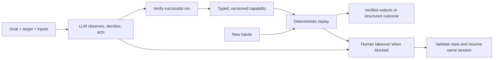

# Agent UI Execution Engine

Turn an agent's intent into a reusable, verifiable workflow through a real user interface.

## Current state: intent does not guarantee execution

An AI agent can understand a request such as "update this customer's mailing address," but completing it requires access to the application where that information lives. In applications without a usable API, the work happens through screens: search for a record, open its details, fill fields, review a change, and verify the result.

Handwritten UI scripts require someone to encode each workflow. An LLM can discover those steps, but asking it to reason through the same interface on every request repeats model calls and introduces variability into execution. Both approaches must still handle missing records, validation errors, expired sessions, slow pages, and uncertain outcomes after a write.

The problem is turning an agent's goal into repeatable UI execution with explicit limits, meaningful results, and a safe path to human assistance.

## Desired state: reusable capabilities an agent can invoke

A calling agent should supply a capability and typed inputs, then receive verified outputs or a clear explanation of why execution could not finish.

For a known workflow, the engine should:

- Follow the saved procedure with new inputs, without asking a model to choose the steps again.
- Check that it reached the intended record and final state.
- Distinguish a legitimate business outcome from a technical failure.
- Recover from known transient conditions within fixed limits.
- Hand the live session to a person when it cannot safely proceed.
- Preserve sanitized evidence that explains what happened.

## The bridge: discover, record, replay

The engine separates learning a workflow from executing it repeatedly.



**Discover.** The LLM receives the goal and a structured observation of the current UI. It proposes a typed action; the engine validates the action, applies policy, executes it, and observes the result. The sequence is not hardcoded. Discovery ends on verified success, a step/time limit, or a condition requiring intervention.

**Record.** A successful run becomes a capability independent of the model transcript. Concrete example values become explicit input bindings. Temporary element references become reusable target descriptions. The capability declares what it accepts, what it does, what it returns, and how success is checked.

**Replay.** The engine validates new inputs and executes the recorded actions using fixed targeting, waiting, condition, and recovery rules. Replay has no model decision path. Unexpected states produce a safe stop or a human intervention request.

Determinism describes how the engine chooses actions; it does not freeze the application's data or guarantee that every invocation succeeds. A changed record or unavailable service can produce a different, explicitly reported outcome.

## Initial workflow

The first implementation covers a multistep workflow in a local application with synthetic data. Additional capabilities use the same engine contracts.

The demonstration is **customer address update**:

```text
Goal: Update customer C-104's mailing address and verify the change.

UI flow to be discovered:
Search customer -> open profile -> edit address -> review -> save -> verify

Reusable contract:
update_customer_address(customer_id, address)
    -> status, confirmation_reference
```

It exercises input binding, a state-changing action, success verification, sensitive-field redaction, and recovery after uncertain writes. Saving the address is the explicit approval boundary. The returned customer ID and saved address fields must match the supplied inputs.

The engine must complete the workflow through the UI. The demo's database or application endpoints will not be used as shortcuts by the automation.

## Proposed architecture

| Component | Responsibility |
| --- | --- |
| Surface adapter | Observe visible state, resolve targets, perform actions, and capture sanitized failure evidence. Playwright provides the first browser implementation. |
| Discovery runner | Run the LLM observe-decide-act loop with validated actions, progress checks, and execution limits. |
| Capability recorder | Convert a verified run into a parameterized, typed, versioned artifact and validate it for reuse. |
| Replay runner | Bind inputs, execute ordered steps, evaluate conditions, extract outputs, and apply fixed recovery rules without a model. |
| Session controller | Track control ownership, pause automated actions, record human interaction, and validate resumption in the same session. |
| Policy and evidence | Enforce allowed destinations/actions, gate risky operations, redact sensitive data, and record structured events. |

These components will live in a small Python package with a CLI. Workflow logic will depend on observation/action contracts rather than Playwright objects, leaving room for legacy web and desktop adapters.

## Capability contract

A saved capability will describe:

- Its name, purpose, schema version, workflow version, and application compatibility.
- Typed input parameters and output fields.
- Ordered actions with explicit parameter bindings.
- Target descriptions and scopes, with uniqueness checks and fixed fallback rules.
- Preconditions, checkpoints, and terminal success or business-outcome checks.
- Bounded recovery rules and human intervention boundaries.

Targets will prefer semantic roles, labels, and visible context where available. Missing or ambiguous matches must not silently select an arbitrary control.

A successful discovery does not establish every alternate business condition. Recovery and outcome rules will have documented provenance and separate validation. Parameterization will be checked by replaying with different inputs.

## Failure handling and human control

| Condition | Planned behavior |
| --- | --- |
| Record missing or invalid business input | Return a typed business outcome. |
| Slow page or known transient load failure | Wait or retry within a fixed budget when safe. |
| Save times out and the result is uncertain | Inspect the visible application state before retrying; escalate if the result cannot be established. |
| Session expiry or approval needed | Request human intervention with the goal, step, current state, and reason. |
| Permission denial, ambiguous target, or unrecoverable app error | Stop with a structured explanation and sanitized failure evidence. |

Human takeover will use the existing browser session. The controller will stop automated dispatch, settle the current action, explicitly transfer ownership, and record supported human actions with sensitive values removed. On an explicit resume signal, it will verify the current state before continuing. Human-assisted execution will be distinguishable from unattended replay in the logs.

## Safety and operating boundaries

The same policy layer will apply to discovery and replay. It will enforce configurable destination and action allowlists, including navigation caused by UI actions. Risky writes will require a configured approval or be blocked; the model's own description of an action as safe will not authorize it.

Observations and evidence will be sanitized before model transmission or persistence. Credentials, tokens, browser session state, and raw sensitive values must stay out of capabilities and logs. Page content is untrusted input and cannot override execution policy.

The initial design assumes relatively stable interfaces and prioritizes runtime failures. Structured text observations suit interfaces with usable labels and page structure. Canvas interfaces, remote desktops, and poorly labeled controls may require visual or OS-accessibility adapters; defining an adapter boundary alone does not provide that support.

Cross-tenant reuse will be addressed through application/version metadata, external tenant configuration, constrained overrides, and compatibility checks. Desktop implementation, tenant infrastructure, a capability catalog service, and a full operator console are outside the initial build.

## Proposed technology

| Technology | Purpose |
| --- | --- |
| Python | Engine, CLI, orchestration, and recovery logic |
| Playwright | Browser observation and interaction |
| Pydantic | Typed actions, capabilities, inputs, and results |
| Versioned JSON files | Reviewable capability storage |
| pytest | Contract, safety, replay, and failure-handling checks |
| FastAPI, Jinja2, PostgreSQL | Demonstration application and synthetic records, run with Docker Compose |
| SQLite | Isolated tests and an optional standalone local demo |

Runtime discovery connects to a local Ollama server at `http://127.0.0.1:11434`; the model is selected through the CLI. The model chooses from typed actions derived from the currently visible controls. Form patterns and declared output checks eliminate invalid bindings locally, without sending sensitive values to the model. These choices describe available UI operations, not a prewritten workflow. Development-assistant activity and scripted test fixtures do not count as runtime discovery evidence.

## Implementation plan

| Stage | Work | Completion check |
| --- | --- | --- |
| 1. Define the first workflow | Select the demo, typed inputs/outputs, approval boundary, and model access. | A concrete workflow and its expected outcomes are documented. |
| 2. Build the demo and contracts | Create the minimal UI, synthetic records, action/result schemas, and repeatable fault conditions. | The workflow can be completed manually with two datasets. |
| 3. Add surface control and policy | Implement observation, targeting, action execution, redaction, and logs. | Checks cover ambiguous targets, denied actions/navigation, and secret redaction. |
| 4. Implement genuine discovery | Connect one runtime model and record a successful UI run. | Evidence shows model-selected actions and independently checked success. |
| 5. Implement capability replay | Validate saved capabilities, bind new inputs, execute checks, and return outputs. | Replay succeeds on new inputs with model access disabled. |
| 6. Integrate recovery and handoff | Exercise business outcomes, transient errors, uncertain writes, and live human control. | Failure scenarios and actual human takeover/resume produce verifiable evidence. |
| 7. Make the project reproducible | Finalize setup, exact commands, design documentation, and reviewed evidence. | A clean setup can reproduce the documented discovery and replay flow. |

## Project status and setup

The first implementation includes the demo, typed contracts, a browser adapter, discovery and replay runners, policy checks, structured evidence, and human-control mechanisms. A genuine local-model run produced a 14-action capability, which replayed successfully with a different customer and address on the SQLite-backed demo. PostgreSQL container verification and actual human takeover evidence are still pending. This is an initial implementation, not a production-ready automation service.

To start the demo app and database, open Docker Desktop with Linux containers enabled, then run this single command from the repository root in PowerShell:

```powershell
powershell -NoProfile -ExecutionPolicy Bypass -File .\start.ps1 -OpenBrowser
```

The script creates local configuration if needed, preserves existing credentials and data, builds and starts both containers, waits for service health, and opens the app. If container startup fails, it prints service status and recent logs. It does not run discovery or replay automatically.

To run the automation engine as well, install Python 3.11 or later and prepare its local environment:

```powershell
python -m venv .venv
.\.venv\Scripts\python.exe -m pip install -e ".[test]"
$env:PLAYWRIGHT_BROWSERS_PATH = "$PWD/.browsers"
.\.venv\Scripts\python.exe -m playwright install chromium
```

Open **http://127.0.0.1:8000**. Compose runs two services: `app` and `db`. The app waits for PostgreSQL health, creates its schema, and seeds synthetic customers **C-104** and **C-205**. Existing customer changes survive restarts in the `demo-data` volume. The database has no published host port; only the app is exposed on localhost. `demo.setup` creates a random database password in ignored local configuration and preserves an existing file.

Verify the demo manually first: search for a customer, open their profile, edit the address, review, save, and inspect the confirmation. `docker compose ps` shows service health. `docker compose down` stops the services while retaining their database volume.

Then, with a local Ollama server running and the specified model installed:

```powershell
.\.venv\Scripts\python.exe -m engine.cli discover `
  --model mistral:latest `
  --goal "Update the customer identified by customer_id with the supplied street, city and postal inputs. Verify the saved customer ID and all saved address fields. Return every declared output." `
  --inputs config/inputs-a.json `
  --capability work/generated/update-address.v1.json `
  --approve-writes

.\.venv\Scripts\python.exe -m engine.cli replay `
  --capability work/generated/update-address.v1.json `
  --inputs config/inputs-b.json `
  --approve-writes

.\.venv\Scripts\python.exe -m pytest -q
```

`--approve-writes` explicitly authorizes the configured save action for that invocation. Omit it and use `--headed` to require a person to perform the save. Capability files are not overwritten; use a new output filename for another discovery run. Once a capability exists, replay and tests do not need a model server.

To replay the checked-in example without running discovery, use `--capability capabilities/update-address.v1.json`. The `evidence/` directory records the genuine discovery, replay, and not-found outcome already demonstrated on the standalone demo.

Run outputs are written under `runs/<run-id>/`. The Python replay API returns typed outputs; CLI output contains status and the run ID. Persisted sensitive outputs are redacted.

### Failure scenarios and human takeover

Stop the demo server, then start it with one of `normal`, `slow`, `transient`, `session-expired`, `permission-denied`, or `uncertain-save`:

```powershell
.\.venv\Scripts\python.exe -m engine.cli demo --scenario session-expired
```

Replay with `--headed --approve-writes`. When the terminal requests human intervention, use the same open browser: click **Restore session**, search for the customer from the input file, and reach the requested resume checkpoint (normally the results screen with **Open customer**). Type `resume` in the run terminal. Type `abort` to stop. The intervention expires after five minutes. Session restoration is a synthetic demonstration control, not an authentication implementation.

For a manual save approval, run normal replay with `--headed` and without `--approve-writes`. At handoff, inspect the review screen, click **Save address**, and type `resume` after the confirmation screen appears. Human actions and ownership transitions are recorded; automation does not dispatch actions under human ownership.

Failure injection is part of the demo. Scripted browser tests are clearly labeled test fixtures and do not establish that a person performed a takeover.

If a headed browser is unavailable on your desktop, use `--operator-port 8766` instead of `--headed`, then open **http://127.0.0.1:8766** when intervention is requested. This loopback operator page displays a live image of the same browser session and forwards your clicks, typing, and resume/abort signals. It does not create another application session. Images stay in memory and are not saved as evidence. The operator page exists only during a handoff.

### Standalone demo and Docker scenarios

For a standalone SQLite demo, stop the Compose services and run:

```powershell
.\.venv\Scripts\python.exe -m engine.cli demo
```

For a Docker failure scenario, keep the database running and recreate only the app:

```powershell
$env:DEMO_SCENARIO = "transient"
docker compose up -d --force-recreate app
```

Set `DEMO_SCENARIO` back to `normal` and recreate the app to restore normal behavior. The existing failure scenarios and UI are shared by both database backends.

```text
engine/          Discovery, recording, replay, policy, and session control
demo/            Local application with synthetic data
tests/           Automated verification
evidence/        Reviewed capabilities, genuine run logs, and failure evidence
AGENTS.md        Working agreements and decisions
PLANNING.md      Detailed design notes
REQUIREMENTS.md  Requirement-to-acceptance mapping
README.md        Problem, approach, roadmap, and setup
```

Keep local credentials in environment variables or ignored configuration. Browser profiles, local databases, and unreviewed runs are excluded through `.gitignore`. Only reviewed, sanitized evidence belongs in `evidence/`.
