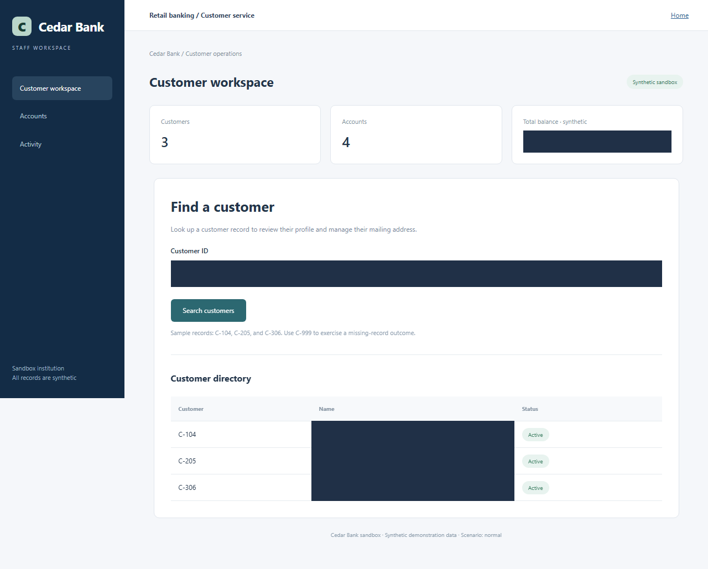
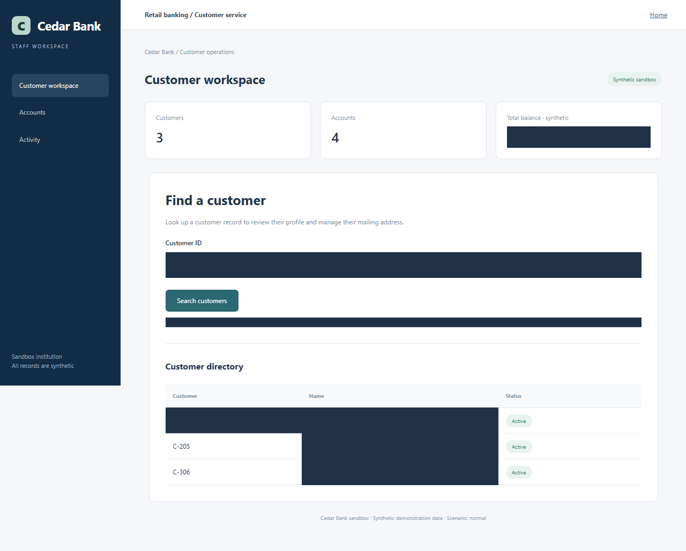
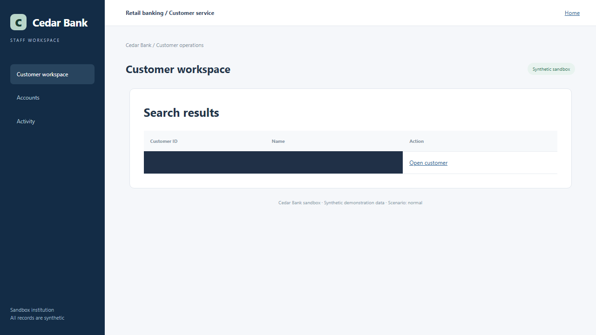
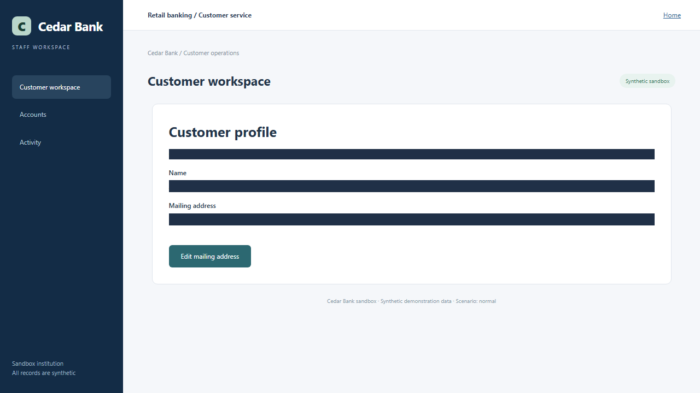
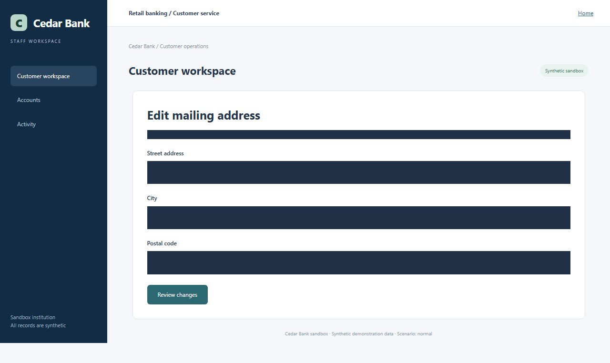
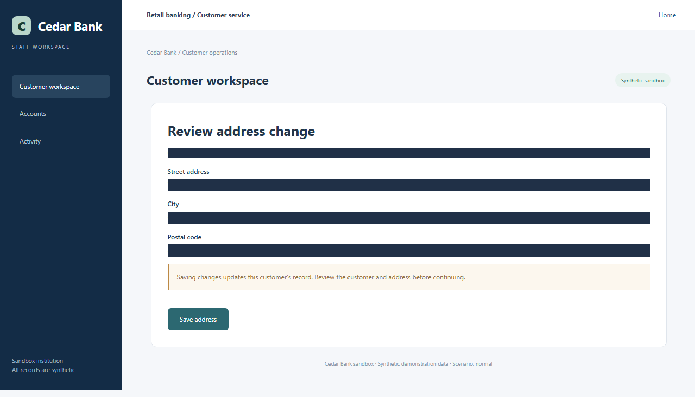
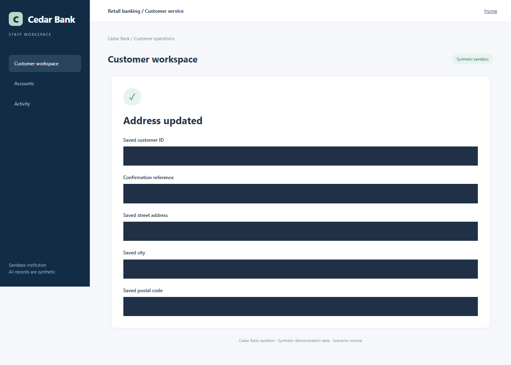

# Human workflow recording

Screenshots are redacted before persistence. Text values are replaced with parameter references.

## Step 1: click (operator gesture; see screenshots)

## Step 2: fill Customer ID

Input parameter: `customer_id`

## Step 3: click Search customers

## Step 4: click Open customer

## Step 5: click Edit mailing address

## Step 6: click (operator gesture; see screenshots)

## Step 7: fill Street address

Input parameter: `street`

## Step 8: click (operator gesture; see screenshots)

## Step 9: fill City

Input parameter: `city`

## Step 10: click (operator gesture; see screenshots)

## Step 11: fill Postal code

Input parameter: `postal`

## Step 12: click Review changes

## Step 13: click Save address

